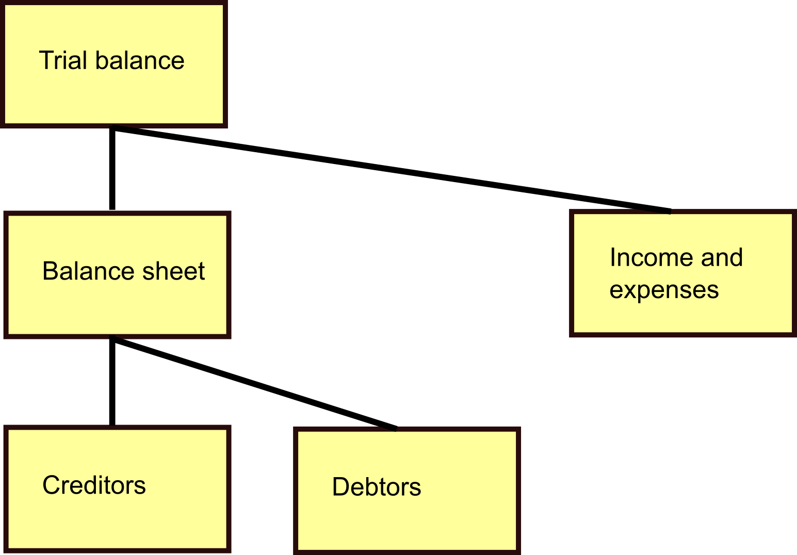

GLedger GLModels - The GLedger model classes
============================================
    
The GLModels module contains the classes of the General Ledger model.

These models are the building blocks for the application. They contain the fields in the database. The classes with these fields are also the classes where the system calls functions on, to return instances of the classes and to alter the values in the database.

The account
-----------
Accounts are the central item of GLedger data. Not only does it contain the functional information what this account is about (e.g the human readable name, the type (asset, liability, income, expense)), but also it links to the parent account to take its place in the structure. See :ref:`ledgerstructure`.

The account balance
-------------------
For the accounts we of course maintain the account balance. If you look in the database you will see different account balances - what gives?!

As a measure to enable removing or compressing history we keep the balance per posting month. For months where the account is closed, the balance is the ultimo balance of that accounting month, for the current month it is the accumulated balance for this month.

.. _ledgerstructure:

Interlude - the ledger structure
--------------------------------

Accounts are structured as a tree. At the top there is the trial balance account. All accounts link to their parent, when you want to know what children an account has, you find the ones that link to this one as its parent. Any account can only have one parent, one account has no parent.

The posting
-----------
Each posting applies an amount to the account in the posting, for the posting month mentioned. We refer to that as processing the posting. Currently each posting in the journal is for the same month, to evade complex processing to determine of journals balance for every month. 

The journal
-----------
Journals are lists of postings where the total of debit amounts and credit amounts is equal. The individual amounts don't need to be equal. For example sales may be balanced by a combination of decreasing the value of stocks and increasing taxes to be paid.

Journals can be entered through the API. Journals, contain postings that will contain the account to post to, the value date and the posting month. The posting month defaults to the current month, but for corrections it is possible to post to another posting month.

Processing of the postings is done by journal. The journal contains a flag whether it is successfully processed. As all postings are processed in journals that balance, it is guaranteed that the ledger balances. If a journal does not balance, or there is another error in the journal, it is not processed. A corrected version should be sent by the system that delivered it. 

The posting month
-----------------
To prevent accidental updating of posting months that are considered done, these can be closed. This prevents the system from accepting postings, actually all of the journal containing the offending posting will be rejected.

The system has no opinion on closing the posting month. This will only be done by the user, no automatic processing is available.
